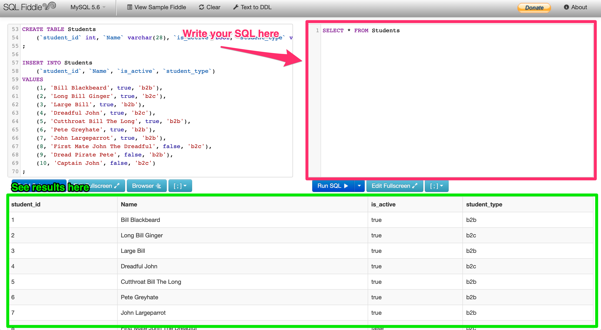

# Assignment

Please use sqlfiddle environment (created in [01_prepare](01_prepare.md) step) to answer questions.

## Questions to answer

1) Average number of finished courses to every active B2B student.

2) Average number of started courses to every B2C student.

3) Overall study length of every student.

Copy your SQL scripts (no data are needed) into [03_results](03_results.md) and follow next steps.
